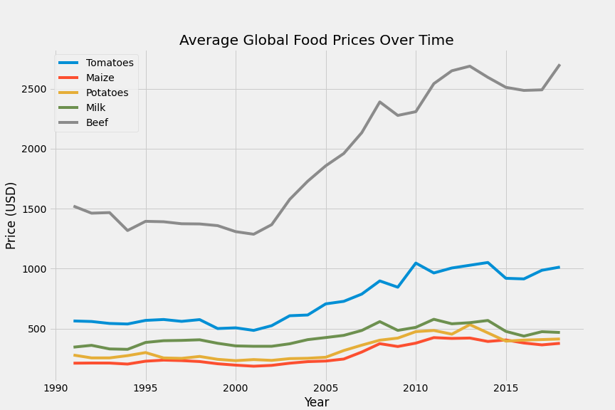

# Global Food Prices

by Jacob Prebys

**A Study of Global Food Prices**

Not really sure what I'm going to do here yet, but I found [this dataset](http://www.fao.org/faostat/en/#data/PP/metadata) from FAOSTAT (a UN subsidiary) with the following description:

> Producer Prices are prices received by farmers for primary crops, live animals and livestock primary products as collected at the point of initial sale (prices paid at the farm-gate). Due to differences in data collection infrastructure and capacity, some countries do vary from this concept by collecting, instead, wholesale or local market prices. While these may be good proxies of farm-gate prices when the marketing chain is very limited, they tend to be poorer proxies in economies where transport and commercial margins constitute a significant share of the final product price. At the far extreme, some countries report retail prices, which are typically very poor proxies for producer prices.

I also found [this dataset](https://data.humdata.org/dataset/wfp-food-prices) from the World Food Program with the following description:

> This dataset contains Global Food Prices data from the World Food Programme covering foods such as maize, rice, beans, fish, and sugar for 76 countries and some 1,500 markets. It is updated weekly but contains to a large extent monthly data. The data goes back as far as 1992 for a few countries, although many countries started reporting from 2003 or thereafter.

# Data Exploration

First I'll look into the FAOSTAT dataset. At first glance, I have prices in USD for various years in many different countries. There are entries from 1991 to 2018, with roughly 3400-6000 price entries for each year. First I'd like to look at a few select food types and their average prices over time.

So I can see a general upward trend with a couple interesting features:

- A slight price dip in the early 2000s
- A high point for almost all food prices in the early 2010s, corresponding with the [2010-2012 world food price crisis](https://en.wikipedia.org/wiki/2010%E2%80%932012_world_food_price_crisis)

https://hackernoon.com/machine-learning-food-datasets-collection-db21e38ea225
